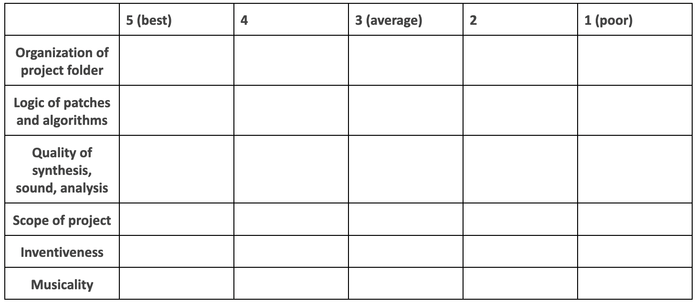

---
# Feel free to add content and custom Front Matter to this file.
# To modify the layout, see https://jekyllrb.com/docs/themes/#overriding-theme-defaults

# layout: archive   
layout: single   
title: "Final Exam: Synthesis Techniques"   
lang: en   
ref: grade  
permalink: /final-project/   
toc: true  
toc_label: "Final Exam Contents" # default: Content
toc_icon: "graduation-cap"  # corr esponding Font Awesome icon name without the "fa" prefix
toc_sticky: true   # enables sticky toc  
read_time: true  
date: 2024-05-17    
last_modified_at: 2024-05-17   

---

### Deadline: 8 July 2024 by 20:00      

### 1. Overview   

The final exam is a _working patch for a composition_ for instrument(s) or some kind of performer alongside electronics realized in MaxMSP with occasional _checkpoints_ where I evaluate your progress throughout the remaining weeks of the semester. The piece must be **mixed**, meaning it must include **realtime control by a live performer** (or using _simulation audio_ in the absense of a performer, as described below). 

If you would like to produce a **fixed media** work (that is, music that exclusively draws from electronic sounds and nothing more: no live instrument), or a **generative piece** in which your patch generates sounds by itself, **your patch must still be performed in real-time by someone triggering events**, as described below.  

Your project may be conceived as a _work-in-progress_ but **must be presented as a finished draft of a composition, improvisation, or installation** in a class presentation given during our final class session on {{ site.week-15 }} . 

Your piece _and its class presentation_ count as your final exam grade in this class: **A work that is incomplete or that is not presented will fail the exam**.    

Your piece should **include the synthesis techniques and tools** we explored this semester, especially those which best serve your creative goals. For this, you are encouraged to easily recycle code that we built together each week in class.    

Each week in class we have developed one synthesizer at a time. Your final project **must include at least 2 synthesizers or sound sources in an expressive series of events that change their parameters over time**. Use our in-class patches as the basic building blocks for a larger creative structure of your own.  

To give your piece _shape_ and an _event management structure_, use the [_My Magnum Opus_ Concert Boiler Patches](https://github.com/einbahnstrasse/MHL-CAO-spat-boiler){:target="_blank"} that **we will build together in week 9** on {{ site.week-10 }}. _In other words, be sure you are present in week 9 for this very important tutorial!_ This boiler patch allows you to place many synthesizers into a single patch, along with input and ouput control, and to shape a concert piece or installation with many individual "moments."    

You can also use our Final Exam piece as an opportunity to develop a new piece for any other recital or commission obligation at MHL or elsewhere, but it **must meet the requirements of our exam as detailed below**. 

By the deadline below, send me a **project folder** (by email, WeTransfer.com, or any accessible cloud link) meeting the following criteria:  

### 2. Procedure / General Timeline   

1. If you’re unsure how to begin, **start with one of our class pedagogical patches and/or a series of parameters that most fascinates you or sounds the most interesting to**. Develop a plan that freely explores how to create and transform these sounds. Use your own sound files, or samples you found elsewhere, as input to your patches. Your project will take shape as you explore.  
2. Your piece can be _(but is **not** required to be)_ a work that **includes a live stage performer (or small number of performers)** with electronically-produced sounds. To facilitate this, **you may record a live performer**, a friend, or yourself, and use this recording **as a simulation of a live performer** and as the input to your patch _(see instructions given in class)_. Your live input to the patch **can also be a MIDI device** performed in realtime that controls your synthesizers. However, it is best to use this project as an opportunity to communicate and collaborate with another artist, so you are encouraged to work with someone in addition to yourself. You may optionally invite your performer to join us in class on {{ site.week-15 }} to perform a brief demonstration of your piece. In this case, you as composer/improsivor/creator, will be responsible for **controlling your Max patch while other musicians perform your piece**. You are also welcome to perform on another classmate’s composition to encourage collaboration. _It is highly recommended that you consider and approach performers early so that you don't fall behind schedule. Pieces for 1 or 2 players are recommended: More parts will pose more challenges. Pieces involving more than 4 parts require special approval from the instructor._     
3. Your piece can be an improvisational performance environment if you prefer, but you must also include an **event management system** that gives your Max patch conrol over larger sections of your piece. You can _optionally_ include a **notated score** in any form of traditional or graphic notation, but this is not required; use whatever form of representation that best serves your goals. However, **I need to see that you have a clear plan in your patch**. So, at a very minimum, be sure to write individual events into your patch that provides a sense of overall movement or direction in your piece.     
4. **Your project and its materials may change** as you begin working and as we explore new topics each week. Allow yourself the flexibility to adapt and change direction in the coming weeks.   
5. Reach out to me at any point for support, guidance, clarification, or with any questions that might arise. Be sure to **use the Debugging slides** to debug your work efficiently!   
6. By the deadline, **submit your folder of patches and everything necessary to run it on another computer**. To best prepare for this, load your project on another computer or a classmate’s computer — as you initialize your patch, check the console for error messages indicating any missing components.  

#### 2.1 Checkpoints   

Checkpoints are opportunities for me to evaluate your work as the semester continues. By the dates below, I will need to see evidence of your progress towards the final deadline:   
   
* **1st Checkpoint**: week 10: {{ site.week-10 }}   
    - Share your initial plans, sounds, compositional, algorithms, or musical ideas   
    - At least 1 small Max patch demonstrating your work with our course materials   
* **2nd Checkpoint**: Week 12: {{ site.week-12 }}   
    - 2-3 presets with evidence of your control over synthesis           
    - Your ideas about _transitions_ between these 2-3 "states"  
* **3rd Concert Patch Checkpoint**: Week 13: {{ site.week-13 }}  
    - Your concert patch (_in progress_) **must take the form of the template** built in week 9: [_My Magnum Opus_ Concert Boiler Patches](https://github.com/einbahnstrasse/MHL-CAO-spat-boiler){:target="_blank"}   
    - Individual **events** should now be numbered and coded into your patch   
    - revisions will be sent to you by email or Discord; 
    - **_you must finish revisions before the final deadline!_**
* **4th and FINAL EXAM DEADLINE!**: _before_ Week 15:  
    - Deadline to receive your final exam is: **Monday 8 July by 20:00**  
    - Final copies of your patch / project folder tested and sent to instructor by this date and time.     
* _Grades and notes on final versions will be sent after classes have finished._    

We may also schedule **individual meetings** around the time of these deadlines to discuss the progress of your work.  

### 3. Things Your Project Should Have   

The elements described below are already available to you in the [_My Magnum Opus_ Concert Boiler Patches](https://github.com/einbahnstrasse/MHL-CAO-spat-boiler){:target="_blank"}    template we will build in our previous semesters. Your project must reproduce this basic structure as a minimum requirement:      

1. A **folder** of your patches, abstractions, or other dependencies. Your folder structure should look like this:   
  
  
  
2. Your project folder can be **its own Github repository** or you can give it a folder **within your class repository**.        
2. A clearly labeled **main patch** serving as your central interface that loads your other sub-patches, sounds, synths, etc.       
3. An **initialization (“init”)** routine that sets your piece's starting parameters, readying everything before your patch produces its first sound or event number.  
4. An **input and output patch**: steal these from the versions we created in Week 1!   
5. A **“script” (event management system)** for individual events and transitions. Use **remote message boxes** and a counter system as demonstrated in the _MyMagnumOpus_ boiler patch.    
6. Replace all `loadbang` and `loadmess` objects with `receive` objects. Be sure to create `receive` objects for any `preset` object you might use: so that you can control **which preset number** to send from your remote messaging script.    
6. Your project should draw on a **combination** of sound sources, synthesis processes, and/or treatments of your choosing. It can include many sources of control: for example, MIDI controllers, random generation, or even the use of `bach` to introduce notated score elements.      
7. Your project should in some way **respond to the tools and aesthetic approaches we learned in class**, even if it is positioned as a strong departure from these. How is your work related (or not) to these lessons?   
8. If you choose to use **multichannel spatialization**, kindly note: In the studio, we are **limited to a 4-channel box**. You can quickly adapt a multichannel `spat~` scene with a different speaker setup later.     
9. Strive for **tonal balance in your sounds and layers**. For example, use **EQ** and **compression** to improve the interaction between overlapping sounds or layers, with special attention to how the sounds change as a result of multichannel spatial movement.  
10. Sound files and samples should be exported at our standard **sample rate of 48 kHz** and a **bit depth of 24 bits** (48 kHz / 24 bits).  
11. Your Max patch should also run at this sampling rate. Set the Audio Status window accordingly.    
12. _Optionally_, you may provide a **score** for your piece that _includes event numbers_ to be executed in your patch alongside a performer’s notated line. Include a PDF copy of your score inside your project folder.  
13. Though not required for this version of your piece, it is always best practice to include a **tech rider** that satisfies the basic requirements of [MHL Digitale Kreation's Tech Rider Template](https://drive.google.com/file/d/1qSDk5n4pOZWnoo5Jj_9UEYvdXekN65xx/view){:target="_blank"}. Use this tempalate provided through our [Tech Rider Workshop](https://youtu.be/cniHDY2N3Ig?si=jnvBIG2DfKkuf-3o){:target="_blank"}. _In the professional world, you will need to supply a tech rider with your piece!_      

#### 3.1 Concert Patch with Live Performer(s)   

This scenario may work best for those composing musical time _linearly_ (that is, for those accustomed to planning the general _moment-to-moment succession of musical events_), but you are **highly encouraged to explore _non-linear_ approaches**: that is, by allowing the classical performer or improvsier, audience members, or even a real-time data analysis stream to spontaneously influence or change the course of the piece. Despite its name, this option can employ any number of real-time tools as a substitute for the traditional control mechanisms over a patch.    

### 4. Problematic Elements   

In general, almost everything is permissible, but there are a few ground rules. Avoid these:   

* **Signal processing of music or audio that is not your own**. All source materials should belong to you: _your_ patches and _your_ recordings. As much as I love mashup artists, this is unfortunately not the proper setting for using identifiable excerpts of someone else’s musical material. The use of “found” sound materials is permissible and is not equivalent to the use of fully-produced recordings for which you do not have copyright clearance secured, so please avoid this. 
* **Patches in which sound is produced only from a single source**. We made many individual synthesizers this semester, but now it is your job to use these **as building blocks for some larger structure**. Monosynths are also problematic in this way: apply your knowledge of `poly~` to the synthesizers we made in class in order to gain more control and combine things in your `DSP subpatch`. If you are exploring the gradual transformation of one sound, these procedures need to unfold in some way that makes use of multiple tools and perceivable changes over time.  
* **Overemphasis on pop music production norms at the expense of our synthesis goals**. While I don’t mind if your final composition utilizes a typical pop music instrumentation or includes a beat, music that adheres strongly to song form based on typical chorus/refrain, or which overemphasizes vocals and lyrics, does not make sufficient use of our synthesis tools, or does not address or respond to the aesthetic questions studied in our class, will not be considered sufficient in scope. This class is an opportunity to deepen your understanding of more subtle and abstract musical relationships. If you normally write songs, use this project to compose something you’ve never composed before, like a granular piece, which will enrich your compositional and listening skills. A creative departure from basal songwriting is expected and will be graded closely.  
* **Use of software we did not learn in class**. All of your materials should stem from our lessons in MaxMSP and our physical modeling tools, using your own field recordings or samples, and any other tools explored in class. The use of other software tools and external sample libraries is strictly prohibited. Pending availability, you may opt to record your own sounds on our MHL modular synthesizers, but you may not sample other software instruments or synthesizers.  

### 5. Rubric  

Details in the boxes below will be filled in upon grading and provided as feedback at the end of the semester. Each of the grading components below will be weighed against the others for a complete project grade.  

  

Of these, **musicality** refers to the _technical aspects in service of your sonic and creative goals and not to prior knowledge of musical history, theory, composition_, etc. Does your work sustain listener interest? Do your sounds modulate and develop, or do they stay stationary for too long? Does your piece create a sense of direction or motion? **Quality** refers to the synthesis itself; do your sounds distort when you don’t intend for them to? (Music based on distortion is great; but is it wildly out of control all the time?) Are your sounds and effects executed in a controlled manner? Are you using compression logically? Are you introducing unwanted artifacts into your sound? What is predictable about the functioning of your patch? These are some of the considerations formulated in these two categories.  

If you have any questions, please don't hesitate to reach out to me and ask.  

_I'm looking forward to seeing your pieces come to life!_  

* * *    
