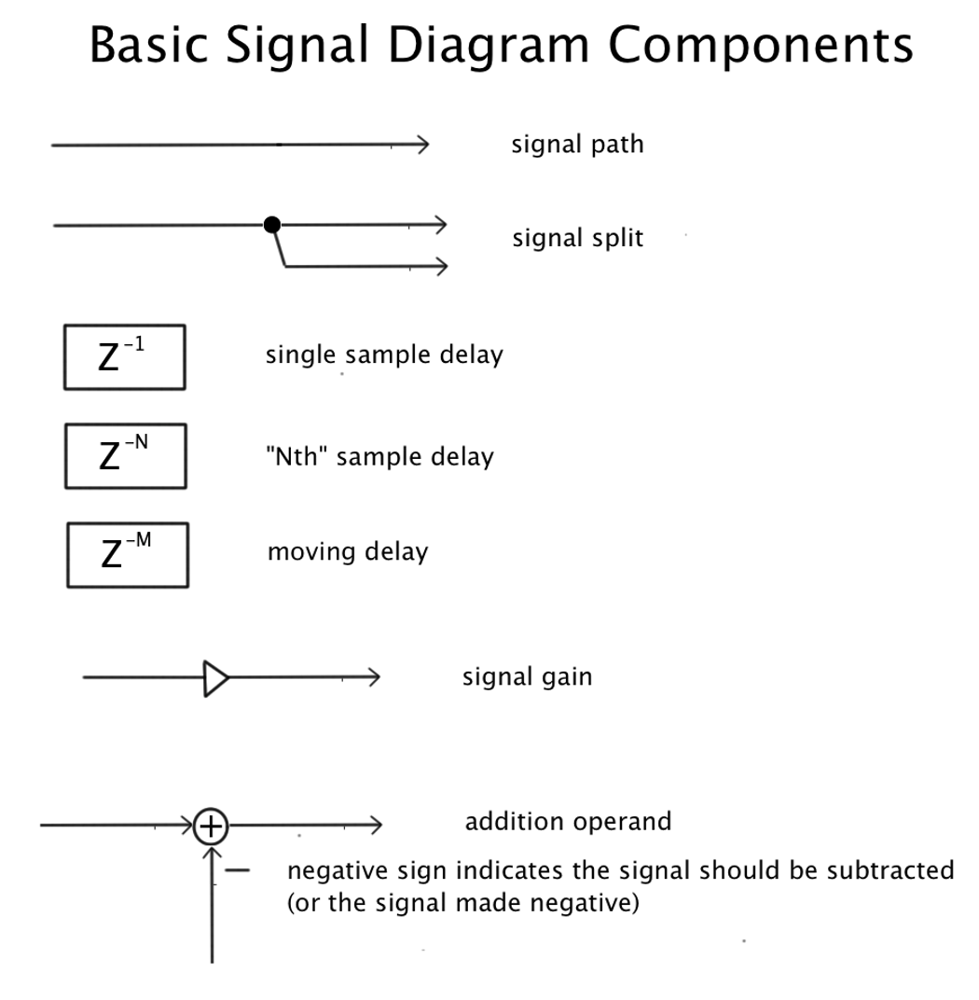

---
# Feel free to add content and custom Front Matter to this file.
# To modify the layout, see https://jekyllrb.com/docs/themes/#overriding-theme-defaults

# layout: archive
layout: single   
title: Schedule   
lang: en   
ref: sched   
permalink: /schedule/   
# sidebar:
#   nav: "schedule-toc"   
toc: true  
toc_label: "Schedule" # default: Content
toc_icon: "bell"  # corr esponding Font Awesome icon name without the "fa" prefix
toc_sticky: true   # enables sticky toc 
read_time: true  
date: 2024-03-20   
last_modified_at: 2024-03-20   

---

<link rel="stylesheet" href="https://cdn.jsdelivr.net/gh/lipis/flag-icons@6.11.0/css/flag-icons.min.css"/>

  
  
    <li class="zoom"><a href="{{ page.url }}" class="{{ page.lang }}"></a></li>
  

  <i class="fas fa-bell fa-2x"></i>

<!--  -->

<!-- # Schedule -->
_This page will be updated frequently with examples, video tutorials, links to new resources, and occasional updates to LAB ASSIGNMENTS. Our schedule follows the [Current MHL Academic Calendar]({{ site.MHL-calendar }}){:target="_blank"}. The following topics and their precise order may change. Check here for updates!_  

* * *

## Week 1: {{ site.week-01 }}  
### {{ site.week-01-topic }}    

#### Start-of-Semester Business  

* Review [Syllabus + course policies.](/MHL-Synthesis-Techniques/index.html){:target="_blank"}  
* Review [Software Installation.](/MHL-Synthesis-Techniques/resources/){:target="_blank"}  
<!-- * Review [Detailed Breakdown of Grading.](/MHL-Synthesis-Techniques/grading/){:target="_blank"}   -->

#### Listening   
<!-- * [Hugh Le Caine, _Dripsody_ (1955)](https://youtu.be/zvHSvSBwFYM?si=5ZvFFPUpYwWrJ08L){:target="_blank"}  
* [Joshua Banks Mailman‘s analysis of _Dripsody_](/MHL-studio-methods/assets/images/Mailman.Dripsody.Analysis.png){:target="_blank"}   -->

#### Tutorials     
* [Basic Signal Diagram Components](assets/images/basic.signal.diagram.components.png){:target="_blank"}    

  

#### Downloads  
<!-- * [Interacting With `bach.roll` boiler patches](https://github.com/einbahnstrasse/interacting-with-bach-roll){:target="_blank"}      -->

#### Assignments _(always due before the next class!)_   
* Install + Authorize MaxMSP    
* Install the CNMAT Externals package (_Search for_ `CNMAT Externals` _in Package Manager. See instructions for using the Max Package Manager on our Software + Resources page_.)   
* [Filter Characteristics (Digital Filter Basics)](https://youtu.be/autPNZ9XMa4?si=1FTZB6r6q1NZ5ymU){:target="_blank"}         

    
* [Test Signals (Digital Filter Basics)](https://youtu.be/ItYpQ7hMupQ?si=6lK6s9uRPHI5T4Ck){:target="_blank"}         

    

* * *

## Week 2: {{ site.week-02 }}  
### {{ site.week-02-topic }}    

#### Tutorials   
* [Mechanical Resonance: Tacoma Narrows Bridge Collapse (1940)](https://youtu.be/j-zczJXSxnw?si=xmXJD0aquZbH-n8-&t=8){:target="_blank"}      

    

* [Mechanical Resonance: (1940)](https://youtu.be/j-zczJXSxnw?si=xmXJD0aquZbH-n8-&t=8){:target="_blank"}      

    

#### Downloads   
<!-- * [Bach and `poly~` boiler patches](https://github.com/einbahnstrasse/bach-poly-boiler-patches/){:target="_blank"}      -->

#### Listening   
<!-- * Goeun talks about her new piece _"Into Another"_   -->

<!-- #### Tutorials   -->

#### Assignments   
<!-- * Assign + discuss the [Microphone Cable Coiling](https://einbahnstrasse.github.io/MHL-Synthesis-Techniques/xlr-cable-coiling/){:target="_blank"} Assignment.   -->
<!-- * Assign & disucss [Final Exam: Mixed Piece with Max Patch](/MHL-Synthesis-Techniques/final-mixed-piece/){:target="_blank"}   
* Consider the [score for _**Giffen Good**_ (2014) for Trombone and Live Electronics](https://drive.google.com/file/d/0BwEuqJNr_Pm2SVhTNlZwdWRMSDQ/view?usp=sharing&resourcekey=0-VGg0No-RZ5esl5DVr_0Ygg){:target="_blank"} — as an example approach to using Bach for **generative notation** in a piece of **mixed music**         -->
* [Feedforward Filter (Digital Filter Basics)](https://youtu.be/ffVcEvYvtcQ?si=_ChokCMOvwgirz4f){:target="_blank"}       

    

* [FIR: Finite Impulse Response Filters (Digital Filter Basics)](https://youtu.be/_WoqwSBkhj0?si=Nv6X9APyvN2TFK96){:target="_blank"}         

    

* * *

## Week 3: {{ site.week-03 }}  
### {{ site.week-03-topic }}    

#### Tutorials   

#### Listening   

#### Assignments   
* [Feedback Filter (Digital Filter Basics)](https://youtu.be/NC_dAcvYLsc?si=8KZ38cZTjPHXmMcq){:target="_blank"}       

    

* [IIR: Infinite Impulse Response Filters (Digital Filter Basics)](https://youtu.be/ap1qXBTKU8g?si=v2Y2SJhsltlTc5La){:target="_blank"}         

    

* * *  

## Week 4: {{ site.week-04 }}  
### {{ site.week-04-topic }}    

#### Assignments   

* * *  

## Week 5: {{ site.week-05 }}  
### {{ site.week-05-topic }}    

<!-- #### Tutorials   -->  

#### Downloads  
* [Using Randomness and Reservoirs: Boiler Patches](https://github.com/einbahnstrasse/week.5.boiler.patches){:target="_blank"}     

#### Listening   
* Shai Cohen, **_Algorithmic Puzzle_** (2020) for Piano and Electronics: "_By pressing a key, the Markov synthesis moves forward one step. The notation is what the players press..._"     

    

#### Assignments   
* Assign the [Story Curves Project](https://einbahnstrasse.github.io/MHL-Synthesis-Techniques/story-curves/){:target="_blank"}      
* [1st Checkpoint](https://einbahnstrasse.github.io/MHL-Synthesis-Techniques/final-mixed-piece/#21-checkpoints){:target="_blank"}     

* * *   

## Week 6: {{ site.week-06 }}  
### {{ site.week-06-topic }}    

<!-- #### Tutorials   -->

#### Assignments  
* <em>Deadline to send + receive XLR Cable Coiling videos.</em>  

* * *

## Week 7: {{ site.week-07 }}  
### {{ site.week-07-topic }}    

#### Tutorials    
* [Introduction to <pfft~> Boiler Patches](https://github.com/einbahnstrasse/week.7.boiler.pfft/){:target="_blank"}     

#### Listening   
* Jonathan Bell, **_Au Commencement_** (2016) for Choir and Electronics       

    

#### Assignments   
* <em>Deadline for Story Curves Project</em>     
* [Midterm Exam Checkpoint](https://einbahnstrasse.github.io/MHL-Synthesis-Techniques/final-mixed-piece/#21-checkpoints){:target="_blank"}    

* * *

## Week 8: {{ site.week-08 }}  
### {{ site.week-08-topic }}    

<!-- #### Tutorials   -->

#### Assignments      
* Install MuBu before Week 8 _(See Resources page for details...)_    
* Hans Tutschku, **_Shadow of bells_** (2014) for Piano and Live Electronics  
  - _Watch all 4 video clips in Hans’ series. Here is Part 1:_    

<iframe src="https://player.vimeo.com/video/371859612?h=bb2544d760&title=0&byline=0&portrait=0" width="640" height="360" frameborder="0" allow="autoplay; fullscreen; picture-in-picture" allowfullscreen></iframe>  

  - [Part 2](https://vimeo.com/371859285){:target="_blank"}     
  - [Part 3](https://vimeo.com/371859404){:target="_blank"}     
  - [Part 4](https://vimeo.com/371859503){:target="_blank"}     

* * *

## Week 9: {{ site.week-09 }}  
### {{ site.week-09-topic }}    

#### Tutorials    
* [MyMagnumOpus Boiler Patch](https://github.com/einbahnstrasse/MHL-CAO-spat-boiler){:target="_blank"}     

#### Assignments   
* Start assembling and formatting your piece using today's concert patch template!  

* * *

## Week 10: {{ site.week-10 }}  
### {{ site.week-10-topic }}    

#### Definitions  
* [Chaos Theory](https://en.wikipedia.org/wiki/Chaos_theory){:target="_blank"}   
* [Strange Attractor](https://en.wikipedia.org/wiki/Attractor){:target="_blank"}   
* [Thomas' cyclically symmetric attractor](https://en.wikipedia.org/wiki/Thomas%27_cyclically_symmetric_attractor){:target="_blank"}   
* [MIT Animation of the Thomas Attractor](https://turbowarp.org/197965154){:target="_blank"}   

>"the trajectory of a frictionally dampened particle moving in a 3D lattice of forces"  

>"_b_ corresponds to how dissipative the system is"   

>"_dt_ is the time step: larger values means the particles move faster"   

#### Tutorials  
* [List of Strange Attractors + Fractals](http://www.3d-meier.de/tut19/Seite0.html){:target="_blank"}   
* [Chaotic Sounds Video Tutorial](https://youtu.be/EwunJYwxNcs?si=Rl-yXsSsj6ZUIVhV){:target="_blank"}    

<iframe width="560" height="315" src="https://www.youtube.com/embed/EwunJYwxNcs?si=K4f8AMN_iiqDRYsk" title="YouTube video player" frameborder="0" allow="accelerometer; autoplay; clipboard-write; encrypted-media; gyroscope; picture-in-picture; web-share" allowfullscreen></iframe>

#### Downloads   
* [Chaotic boiler patches](https://github.com/einbahnstrasse/MHL-AC-chaos-boiler){:target="_blank"}    

<!-- #### Assignments    -->

* * *

## Week 11: {{ site.week-11 }}  
### {{ site.week-11-topic }}    

<!-- ### Tutorials  -->

### Assignments   
* [Concert Patch Checkpoint](https://einbahnstrasse.github.io/MHL-Synthesis-Techniques/final-mixed-piece/#21-checkpoints){:target="_blank"}    

* * *

## Week 12: {{ site.week-12 }}   
### {{ site.week-12-topic }}    

<!-- #### Tutorials   -->

#### Listening   
* Magnus Lindberg, **_Joy_** (1989) for Ensemble and Electronics (_excerpts_)  
  <!-- - _Excerpts to be determined._ -->

    

<!-- #### Assignments   -->

#### Assignments   
* <em><a href="https://einbahnstrasse.github.io/MHL-Synthesis-Techniques/final-mixed-piece/#21-checkpoints" target="_blank">Tech Rider Deadline</a></em>
<!-- * [Tech Rider Deadline](https://einbahnstrasse.github.io/MHL-Synthesis-Techniques/final-mixed-piece/#21-checkpoints){:target="_blank"}     -->

* * *

## Week 13: {{ site.week-13 }}  
### {{ site.week-13-topic }}    

<!-- #### Tutorials   -->

#### Assignments   
* <em><a href="https://einbahnstrasse.github.io/MHL-Synthesis-Techniques/final-mixed-piece/#21-checkpoints" target="_blank">Deadline for Final Exam piece</a></em>
<!-- * [Deadline for Final Exam piece](https://einbahnstrasse.github.io/MHL-Synthesis-Techniques/final-mixed-piece/#21-checkpoints){:target="_blank"}     -->

* * *

## Week 14: {{ site.week-14 }}  
### {{ site.week-14-topic }}    

### Listening   
* Anton Webern, **_Variations for Piano_**, Op. 27 (1936)   

    

* Jean-Claude Risset, **_Huit esquisses en duo pour un pianiste_** (1989)  
  - II. Mirrors (2:19)    
  - IV. Fractals (5:53)   

    

### Assignments  

* * *

## Week 15: {{ site.week-15 }}   
### {{ site.week-15-topic }}    

<!-- #### Tutorials  -->

### Listening   
* John Chowning, **_Stria_** (1977)   

    

#### Assignments  

* * *
<!-- 
## Week 16: {{ site.week-15 }}   
### {{ site.week-16-topic }}    

#### Tutorials 

### Listening   
* John Chowning, **_Stria_** (1977)   

    

#### Assignments  

* * *  

## Week 17: {{ site.week-15 }}   
### {{ site.week-17-topic }}    

#### Tutorials 

### Listening   
* John Chowning, **_Stria_** (1977)   

    

#### Assignments  

* * *   -->